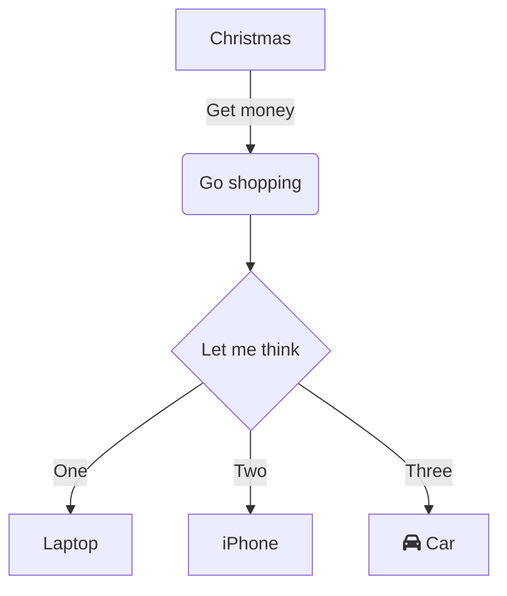
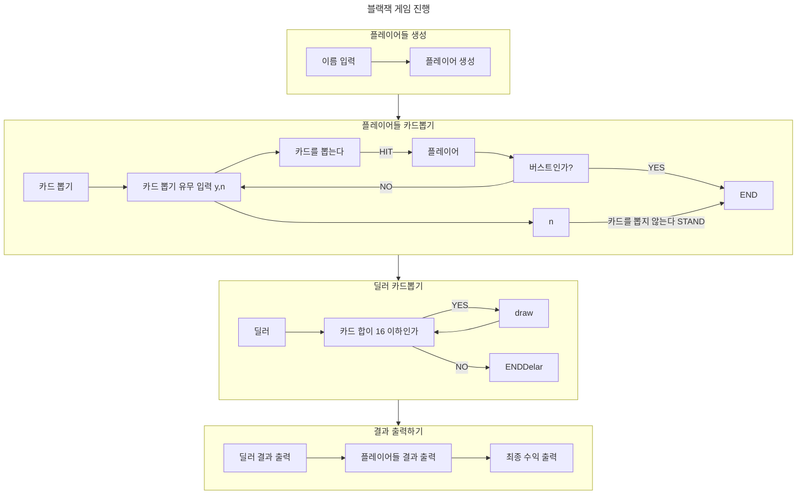

# 서론

마크다운을 이용하여 다이어그램을 작성할 수 있는 Mermaid라는 기능에 대해 알아보도록 하자.

# Mermaid?

Mermaid(이하 머메이드)는 MarkDown 문법을 이용하여 시각적인 다이어그램을 표현할 수 있는 툴이다.
GitHub에서 이를 지원하므로 ReadME.md 파일에 작성해두면 작성 내용을 시각화하여 볼 수 있다.

머메이드 공식 사이트에서 제공하는 문서 및 Live Editor를 이용하여 다이어그램 작성을 진행할 수 있다.

# FlowChart 그려보기

[머메이드 Live Editor](https://mermaid.live/edit#pako:eNpVjstqw0AMRX9FaNVC_ANeFBq7zSbQQrPzZCFsOTMk80CWCcH2v3ccb1qtxD3nCk3Yxo6xxP4W760lUTjVJkCe96ay4gb1NJyhKN7mAyv4GPgxw_7lEGGwMSUXLq-bv18lqKbjqjGodeG6bKh69r8Cz1A3R0oa0_kvOd3jDB-N-7b5_H9ihXPrs-mp7KloSaAieSq4Q8_iyXX5_WlNDKplzwbLvHYkV4MmLNmjUePPI7RYqoy8wzF1pFw7ugj5LVx-AfLqVWg)를 이용하여 다양한 다이어그램의 예시를 확인할 수 있다.

프로그램의 흐름도를 표현하기 위해 FlowChart로 시각화를 하면 도움이 될 것이다.

- 대괄호`[]`를 이용하여 이름(DisplayName)을 지정할 수 있다.
- 화살표 `-->`를 이용하여 흐름 진행방향을 만들 수 있다.
- `||`를 이용하여 의존관계 혹은 흐름조건을 나타낼 수 있다

블랙잭 게임 진행에 대한 간략한 흐름도를 그려봤다.
향후 프로그램 작성 이후 의존 다이어그램을 그려서 프로그램 흐름도를 표현하는 방법도 있을 것 같다.

이 외에도 클래스 다이어그램, 상태 다이어그램, 파이차트 등 다양한 형태의 다이어그램을 작성해 볼 수 있다.

기타 자세한 사용법은 [공식문서](https://mermaid.js.org/syntax/flowchart.html)에서 확인하면 된다.

## 공식문서들

[머메이드 공식 사이트](https://mermaid.js.org/)

[머메이드 공식 문서](https://mermaid.js.org/intro/)

[머메이드 Live Editor](https://mermaid.live/edit#pako:eNpVjstqw0AMRX9FaNVC_ANeFBq7zSbQQrPzZCFsOTMk80CWCcH2v3ccb1qtxD3nCk3Yxo6xxP4W760lUTjVJkCe96ay4gb1NJyhKN7mAyv4GPgxw_7lEGGwMSUXLq-bv18lqKbjqjGodeG6bKh69r8Cz1A3R0oa0_kvOd3jDB-N-7b5_H9ihXPrs-mp7KloSaAieSq4Q8_iyXX5_WlNDKplzwbLvHYkV4MmLNmjUePPI7RYqoy8wzF1pFw7ugj5LVx-AfLqVWg)

# IntelliJ 다이어그램

Mermaid를 사용해서 자신이 설계한 내용이 실제로는 어떠한 의존관계를 가지는지 알아보고 싶다면 IntelliJ에서 다음 기능을 사용해 볼 수 있다.

> 해당 내용은 IntelliJ Ultimate에서 지원하는 기능으로 IntelliJ Community를 사용하는 인원에게는 지원되지 않는 기능임을 사전에 알립니다  😭

# Reference

https://mermaid.js.org/syntax/flowchart.html

https://github.com/greeng00se/java-blackjack/blob/step2/README.md 🌿
